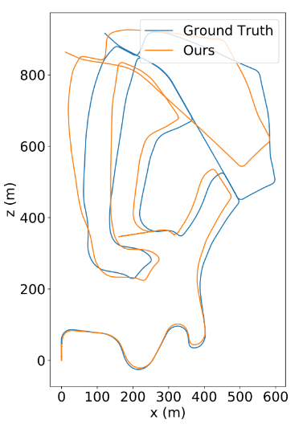
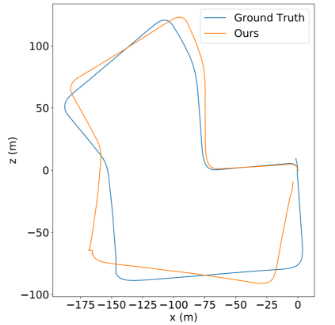

## Intro

Visual odometry (VO) is the essential part of VSLAM systems which estimates camera positions using consecutive images. In recent years, with development of learning-based concepts, classic approach to VO is replaced with deep learning to attempt make the whole pipeline end-to-end trainable using neural networks. In that manner, this work builds upon its predecessors , utilizing both unsupervised and supervised learning, as well as making estimation more robust and versatile using multiple estimations of single pose instead of standard solution in form of Kalman filtering,  thus improving overall accuracy and resistance to outliers. Proposed implementation brings significant improvement and opens new perspectives for future contributions in the field.


              

 *Examples of the trajectory reconstruction, using deep-vslam_multiframe approach*

## Folder structure

This repository contains a number of folders, which are named and which content is at follows:

* deep-vslam: main folder with the codes, which implements our approach. It incorporates multi-step SLAM algorithm which leverages various learning-based components instead of the classical one.
* deep-vslam_multiframe: this is the copy of the main folder which expoits multi-shot pose estimation. Instead of the single-shot pose estimation in VO, which often results in noisy and incosistent estimation, multi-shot approach uses 'reduntant' data from feature generation and matching to obtain multiple poses and finally more robust final estimation.
* DenseMatching: this folder contains the network which extracts correspondences from LIDAR and 2D images and store them in the `./data`  folder.
* sbatch_scripts: if you use sbatch submission system to run the codes and don't have an option to run it directly, take a look at the bash scripts provided here for inspiration

## Getting Started

1. Initial step of the process is the downloading of the [KITTI dataset](https://www.cvlibs.net/datasets/kitti/) and saving it in the folder `./data`
2. Following the instructions in `./DenseMatching` README, one should use it to extract visual features from every frame as well as do the feature matching between the frames of the neighbouring frames. Relevant file to look at, which should be run is named `extract_bundle_adjustment_data_simple/multiframe.py `.
3. Following that, set up the conda environment:

   ```
   cd DEEP_VSLAM
   conda install -f environment.yaml
   conda activate deep_vslam
   ```

## Training

For succesful training, a few steps have to be executed:

1. Set desired values of hyperparams in config files ( config files starting with `train…` and ending with `kitti`, make sure path to config file in `train_network.py` is correct): path to extracted data, network trained, weights of losses, type of losses, path to models (if you are loading some), path to save location for models, on which sequences to train/test…
2. Run the `train_network.py ` or .sh file corresponding to `train_network.py` file (make sure that you are providing proper path to .py file in .sh file)

## Inference

For testing, procedure is similar but different config (`test_opencv_kitti.yml`) and .sh files (`sbatch_test.sh`) are used, you should run `evaluate.py` or corresponding .sh file.
